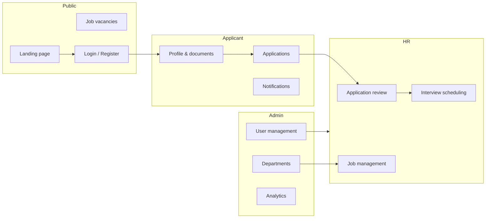

# RecruitPro — Recruitment Management System

A full-stack recruitment platform for organizations in Rwanda and beyond. **RecruitPro** connects applicants, HR teams, and administrators in one workflow: browse vacancies, complete a verified profile, apply online, and manage hiring from dashboard to interview.

---

## Overview

| Layer | Technology |
|-------|------------|
| **Frontend** | React 19, Vite, React Router, Axios, Recharts |
| **Backend** | Spring Boot 3.2, Spring Security, Spring Data JPA |
| **Database** | PostgreSQL |
| **Auth** | Email/password with role-based access (Applicant, HR, Admin) |



---

## Features

### Public
- Modern landing page with live job listings and vacancy detail modal
- Job search by department, location, and employment type
- Separate login and registration experiences

### Applicant
- Profile-first workflow (complete profile before applying)
- NID and NESA verification (simulated APIs for development)
- Upload CV, degree, certificates, and supporting documents
- Apply to open positions and track application status
- In-app notifications for status updates and interview reminders

### HR
- Dashboard with recruitment metrics and latest applications
- Review applications, approve, reject, or move to interview
- Schedule interviews with date, time, and location
- Manage job vacancies and view candidate pipelines
- Reports and interview overview

### Admin
- Manage users (create, update, deactivate, reset passwords)
- Manage departments
- Platform-wide job and report views
- System settings

---

## Application lifecycle

Applications move through these statuses:

`PENDING` → `UNDER_REVIEW` → `INTERVIEW` → `APPROVED` or `REJECTED`

> **Note:** An interview appears on the HR Interviews page only after HR schedules it via **Schedule interview & notify applicant** (not from a custom notification alone).

---

## Project structure

```
recruitment-system/
├── recruitment-system/          # Spring Boot REST API
│   ├── src/main/java/.../
│   │   ├── controller/          # REST endpoints
│   │   ├── service/             # Business logic
│   │   ├── entity/              # JPA models
│   │   ├── repository/          # Data access
│   │   └── config/              # Security, CORS, seed data
│   └── src/main/resources/
│       └── application.properties
│
└── recruitment-frontend/        # React SPA
    ├── src/
    │   ├── components/          # Shared UI (home, header, footer)
    │   ├── pages/               # Applicant, HR, Admin, Auth routes
    │   ├── layouts/             # Role-based layouts
    │   ├── api/                 # Axios client
    │   └── assets/              # Styles and images
    └── package.json
```

---

## Prerequisites

- **Java 21**
- **Maven 3.9+**
- **Node.js 18+** and **npm**
- **PostgreSQL 14+**

---

## Getting started

### 1. Database

Create a PostgreSQL database:

```sql
CREATE DATABASE recruitment_db;
```

Update credentials in `recruitment-system/src/main/resources/application.properties` if needed:

```properties
spring.datasource.url=jdbc:postgresql://localhost:5432/recruitment_db
spring.datasource.username=postgres
spring.datasource.password=your_password
```

Hibernate will create tables on first run (`spring.jpa.hibernate.ddl-auto=update`).

### 2. Backend

```bash
cd recruitment-system
./mvnw spring-boot:run
```

On Windows:

```bash
cd recruitment-system
mvnw.cmd spring-boot:run
```

API base URL: **http://localhost:8080**

On startup, the app seeds demo users, departments, and sample job vacancies (if the database is empty).

### 3. Frontend

```bash
cd recruitment-frontend
npm install
npm run dev
```

App URL: **http://localhost:5173**

For a production build:

```bash
npm run build
npm run preview    # serves dist/ on http://localhost:4173
```

The frontend expects the API at `http://localhost:8080` (configured in `src/api/axios.js`).

---

## Demo accounts

| Role | Email | Password |
|------|-------|----------|
| HR | `hr@gmail.com` | `hr1234` |
| Admin | `admin@gmail.com` | `admin1234` |

Applicants can register at `/register` and choose the **Applicant** role.

---

## API overview

| Endpoint prefix | Purpose |
|-----------------|---------|
| `/auth` | Register and login |
| `/jobs` | Job vacancies (public open jobs + CRUD) |
| `/applications` | Submit and manage applications |
| `/profile` | Applicant profiles and file uploads |
| `/notifications` | User notifications |
| `/users` | Admin user management |
| `/departments` | Department CRUD |
| `/stats` | Dashboard statistics |
| `/api/nid/{id}` | Simulated NID lookup |
| `/api/nesa/{id}` | Simulated NESA grade lookup |
| `/files/download` | Document download |
| `/settings` | System settings |

---

## Email notifications (optional)

SMTP settings are commented out in `application.properties`. Uncomment and configure them to send real emails:

```properties
spring.mail.host=smtp.gmail.com
spring.mail.port=587
spring.mail.username=your-email@gmail.com
spring.mail.password=your-app-password
spring.mail.properties.mail.smtp.auth=true
spring.mail.properties.mail.smtp.starttls.enable=true
```

Without SMTP, notifications are still stored in the database and visible in the applicant dashboard.

---

## Development notes

- **CORS** is enabled for local frontend development.
- **File uploads** are stored under `recruitment-system/uploads/` (max 15 MB per file).
- **Security:** API routes are open in development; authentication is handled at the application layer via login responses and frontend route guards.
- After changing frontend assets or routes, run `npm run build` before `npm run preview`, then hard-refresh the browser (`Ctrl+Shift+R`).

---

## Screenshots

_Add screenshots of the home page, applicant dashboard, HR applications view, and admin panel here._

---

## Author

**Antoinette** — Full-stack recruitment system built as a portfolio and academic project.

---

## License

This project is provided for educational and portfolio use. Contact the author before commercial deployment.
