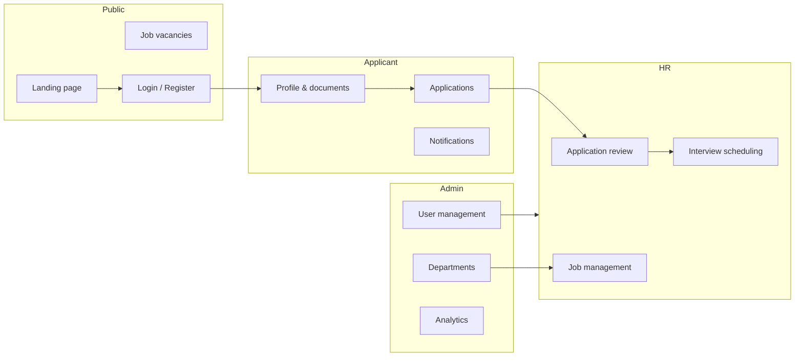

# RecruitPro — Recruitment Management System

A full-stack recruitment platform for organizations in Rwanda and beyond. **RecruitPro** connects applicants, HR teams, and administrators in one workflow: browse vacancies, complete a verified profile, apply online, and manage hiring from dashboard to interview.

---

## Overview

| Layer | Technology |
|-------|------------|
| **Frontend** | React 19, Vite, React Router, Axios, Recharts |
| **Backend** | Spring Boot 3.2, Spring Security, Spring Data JPA |
| **Database** | PostgreSQL |
| **Deployment** | Docker, Render |
| **Auth** | Email/password with role-based access (Applicant, HR, Admin) |



---

## Features

### Public
- Modern landing page with live job listings and vacancy detail modal
- Job search by department, location, and employment type
- Separate login and registration experiences

### Applicant
- Profile-first workflow (complete profile before applying)
- NID and NESA verification (simulated APIs for development)
- Upload CV, degree, certificates, and supporting documents
- Apply to open positions and track application status
- In-app notifications for status updates and interview reminders

### HR
- Dashboard with recruitment metrics and latest applications
- Review applications, approve, reject, or move to interview
- Schedule interviews with date, time, and location
- Manage job vacancies and view candidate pipelines
- Reports and interview overview

### Admin
- Manage users (create, update, deactivate, reset passwords)
- Manage departments
- Platform-wide job and report views
- System settings

---

## Application lifecycle

Applications move through these statuses:

`PENDING` → `UNDER_REVIEW` → `INTERVIEW` → `APPROVED` or `REJECTED`

> **Note:** An interview appears on the HR Interviews page only after HR schedules it via **Schedule interview & notify applicant** (not from a custom notification alone).

---

## Project structure

```
recruitment-system (1)/
├── docker-compose.yml           # Local PostgreSQL (port 5434)
├── recruitment-system/          # Spring Boot REST API
│   ├── Dockerfile
│   ├── .env.example             # Backend env template (copy to .env)
│   ├── src/main/java/.../
│   │   ├── controller/
│   │   ├── service/
│   │   ├── entity/
│   │   ├── repository/
│   │   └── config/              # Security, CORS, database, seed data
│   └── src/main/resources/
│       └── application.properties
└── recruitment-frontend/          # React SPA
    ├── .env.example             # Frontend env template (copy to .env)
    ├── public/_redirects        # SPA routing on Render static sites
    └── src/
        ├── api/config.js        # API base URL (VITE_API_URL)
        ├── components/
        ├── pages/
        └── layouts/
```

---

## Prerequisites

- **Java 21**
- **Maven 3.9+**
- **Node.js 18+** and **npm**
- **Docker Desktop** (recommended for local PostgreSQL)
- **PostgreSQL 14+** (optional if you use your own install instead of Docker)

---

## Environment setup

Configuration lives in `.env` files — do not put secrets in `application.properties`.

### Backend (`recruitment-system/`)

```bash
cd recruitment-system
copy .env.example .env    # Windows
# cp .env.example .env    # macOS / Linux
```

Default local values:

| Variable | Purpose |
|----------|---------|
| `SPRING_DATASOURCE_URL` | `jdbc:postgresql://localhost:5434/recruitment_db` |
| `SPRING_DATASOURCE_USERNAME` | `postgres` |
| `SPRING_DATASOURCE_PASSWORD` | `postgres` (match Docker or your local DB) |
| `PORT` | `8080` |
| `CORS_ALLOWED_ORIGINS` | Frontend URLs (comma-separated) |

> **Important:** Put the host and database in the URL only — do **not** embed `user:password@` inside the JDBC URL. The backend parses Render-style `postgresql://` URLs automatically when deploying.

### Frontend (`recruitment-frontend/`)

```bash
cd recruitment-frontend
copy .env.example .env
```

| Variable | Purpose |
|----------|---------|
| `VITE_API_URL` | Backend URL, e.g. `http://localhost:8080` |

`.env` files are gitignored. Only `.env.example` is committed.

---

## Getting started (local)

### 1. Start PostgreSQL

From the **repo root**:

```bash
docker compose up -d postgres
```

This starts PostgreSQL on **port 5434** (avoids conflicts with an existing install on 5432/5433).

| Setting | Value |
|---------|-------|
| Host | `localhost` |
| Port | `5434` |
| Database | `recruitment_db` |
| User | `postgres` |
| Password | `postgres` |

Hibernate creates tables on first run (`spring.jpa.hibernate.ddl-auto=update`).

**Using your own PostgreSQL instead:** create `recruitment_db`, then update `SPRING_DATASOURCE_URL`, username, and password in `recruitment-system/.env`.

### 2. Backend

```bash
cd recruitment-system
mvnw.cmd spring-boot:run    # Windows
# ./mvnw spring-boot:run    # macOS / Linux
```

API: **http://localhost:8080**

On startup, the app seeds demo users, departments, and sample job vacancies when the database is empty.

**Port 8080 already in use?**

```bash
netstat -ano | findstr ":8080"    # Windows
taskkill /PID <pid> /F
```

### 3. Frontend

```bash
cd recruitment-frontend
npm install
npm run dev
```

App: **http://localhost:5173**

Production build:

```bash
npm run build
npm run preview    # http://localhost:4173
```

---

## Docker (backend image)

Build the API image from `recruitment-system/`:

```bash
cd recruitment-system
docker build -t recruitment-system .
```

Run locally (with Postgres already up):

```bash
docker run -p 8080:8080 \
  -e SPRING_DATASOURCE_URL=jdbc:postgresql://host.docker.internal:5434/recruitment_db \
  -e SPRING_DATASOURCE_USERNAME=postgres \
  -e SPRING_DATASOURCE_PASSWORD=postgres \
  recruitment-system
```

On Windows PowerShell, use `` ` `` instead of `\` for line breaks.

---

## Deploy on Render

You need **three** resources: PostgreSQL, backend Web Service, frontend Static Site.

### 1. PostgreSQL

Create a **PostgreSQL** database on Render and note the connection details.

### 2. Backend (Docker Web Service)

| Setting | Value |
|---------|-------|
| Root directory | `recruitment-system` |
| Runtime | Docker |

**Environment variables:**

| Key | Value |
|-----|--------|
| `SPRING_DATASOURCE_URL` | `jdbc:postgresql://HOST:5432/DBNAME?sslmode=require` |
| `SPRING_DATASOURCE_USERNAME` | From Render Postgres |
| `SPRING_DATASOURCE_PASSWORD` | From Render Postgres |
| `CORS_ALLOWED_ORIGINS` | `https://your-frontend.onrender.com` |

Alternatively, link the database and set `DATABASE_URL` — the backend converts `postgresql://` URLs to JDBC automatically.

### 3. Frontend (Static Site)

| Setting | Value |
|---------|-------|
| Root directory | `recruitment-frontend` |
| Build command | `npm install && npm run build` |
| Publish directory | `dist` |

**Environment variable:**

| Key | Value |
|-----|--------|
| `VITE_API_URL` | `https://your-backend.onrender.com` (no trailing slash) |

After deploy, set `CORS_ALLOWED_ORIGINS` on the backend to match the frontend URL exactly.

---

## Demo accounts

| Role | Email | Password |
|------|-------|----------|
| HR | `hr@gmail.com` | `hr1234` |
| Admin | `admin@gmail.com` | `admin1234` |

Applicants register at `/register` (Applicant role only). HR and Admin accounts are assigned via Admin → Users.

---

## API overview

| Endpoint prefix | Purpose |
|-----------------|---------|
| `/auth` | Register and login |
| `/jobs` | Job vacancies (public open jobs + CRUD) |
| `/applications` | Submit and manage applications |
| `/profile` | Applicant profiles and file uploads |
| `/notifications` | User notifications |
| `/users` | Admin user management |
| `/departments` | Department CRUD |
| `/stats` | Dashboard statistics |
| `/api/nid/{id}` | Simulated NID lookup |
| `/api/nesa/{id}` | Simulated NESA grade lookup |
| `/files/download` | Document download |
| `/settings` | System settings |

---

## Email notifications (optional)

Add SMTP variables to `recruitment-system/.env` or Render environment:

```properties
SPRING_MAIL_HOST=smtp.gmail.com
SPRING_MAIL_PORT=587
SPRING_MAIL_USERNAME=your-email@gmail.com
SPRING_MAIL_PASSWORD=your-app-password
```

Without SMTP, notifications are still stored in the database and visible in the applicant dashboard.

---

## Development notes

- **CORS** — configured via `CORS_ALLOWED_ORIGINS`; defaults allow `localhost` in development.
- **File uploads** — stored under `recruitment-system/uploads/` (max 15 MB per file). On Render, disk is ephemeral unless you add persistent storage or external object storage.
- **Security** — API routes are open in development; authentication is handled via login responses and frontend route guards.
- **Frontend rebuild** — after asset or route changes, run `npm run build` before `npm run preview`, then hard-refresh (`Ctrl+Shift+R`).

---

## Author

**Antoinette** — Developer of RecruitPro, a production-ready recruitment management platform for real hiring workflows.

---

## License

Proprietary. All rights reserved. Contact the author for licensing or deployment inquiries.
